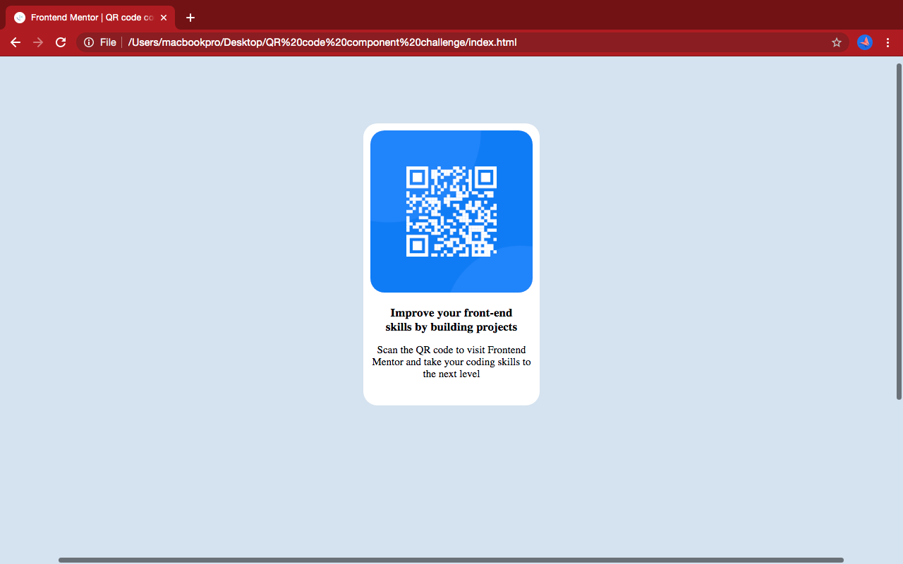

# QR-code-component-solution
# Frontend Mentor - QR code component solution
This is a solution to the [QR code component challenge on Frontend Mentor]

## Table of contents
- [Overview](#overview)
  - [Screenshot](#screenshot)
  - [Links](#links)
- [My process](#my-process)
  - [Built with](#built-with)
  - [What I learned](#what-i-learned)
  - [Continued development](#continued-development)
  - [Useful resources](#useful-resources)
- [Author](#author)
- [Acknowledgments](#acknowledgments)

## Overview
### Screenshot

### Links
- Github repo URL: (https://github.com/UsmanaminaIbrahim/QR-code-component-solution)
- Live Site URL: (https://usmanaminaibrahim.github.io/QR-code-component-solution/)

## My process

### Built with

- HTML5
- CSS

### What I learned

I keep trying for 2 days straight and still didn't get it right not from what i thought to be simple.. I was so frustrated😂 💔 and i know i shouldn't be discouraged i took a break and sort it out on a piece of paper before trying again and it worked. I learned the use of divs and more divs.. this is my first time trying Css positioning i still don't know if i got it right.

### Useful resources

- [Resource](https://www.w3schools.com) - The documentation helped me alot i read through when i get stuck.

## Author

- Linkedin Usman Amina Ibrahim](https://www.linkedin.com/in/usmanamina)
- Frontend Mentor - [@UsmanaminaIbrahim](https://www.frontendmentor.io/profile/UsmanaminaIbrahim)
